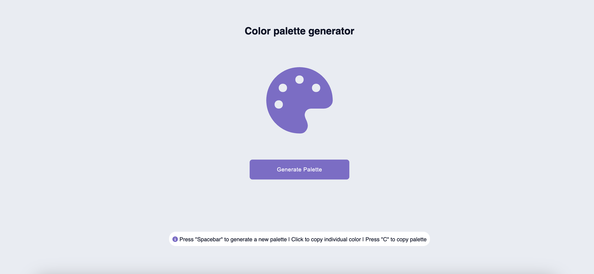
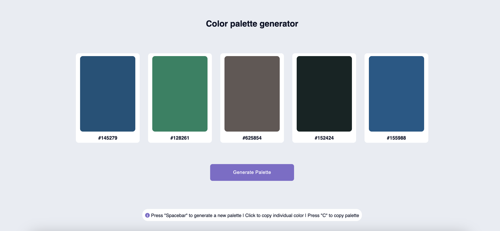
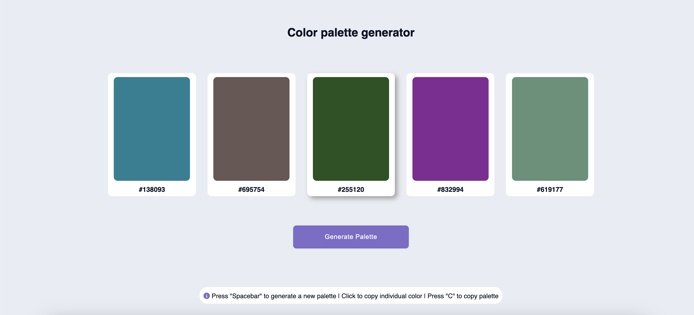
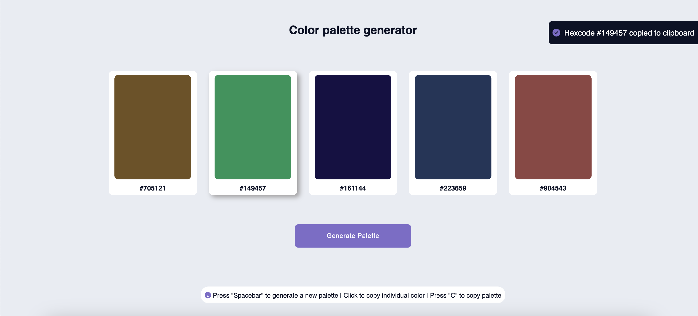

# Color palette generator

This web application allows users to generate random color palettes effortlessly. By pressing the Spacebar, a new palette is created. Users can click on individual colors to copy their values or press C to copy the entire palette.​

## Features

- Random Palette Generation: Quickly produce diverse color schemes with a simple key press.
- Easy Color Copying: Click on any color to copy its code or press C to copy all palette colors at once.

## Demo

[Live Demo](https://color-palette-generator-sigma-bay.vercel.app/)

## Screenshots






## Installation

### Clone the repository

```bash
git clone https://github.com/vmanidev/color-palette-generator.git
cd color-palette-generator
```

## Tech stack

- HTML
- CSS
- JavaScript

## License

This project is licensed under the MIT License. See the **License** file for more details.
